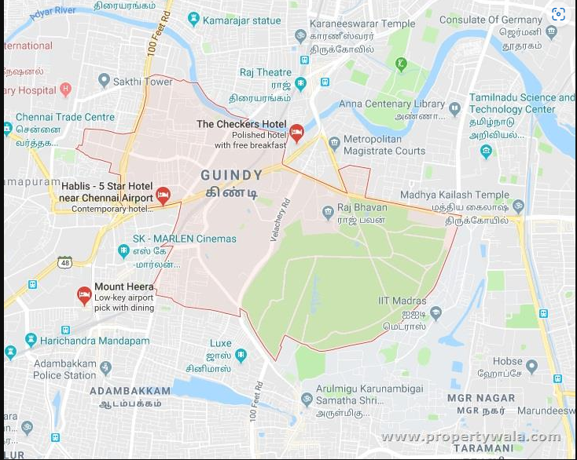

# Ex04 Places Around Me
## Date: 08/12/2024

## AIM
To develop a website to display details about the places around my house.

## DESIGN STEPS

### STEP 1
Create a Django admin interface.

### STEP 2
Download your city map from Google.

### STEP 3
Using ```<map>``` tag name the map.

### STEP 4
Create clickable regions in the image using ```<area>``` tag.

### STEP 5
Write HTML programs for all the regions identified.

### STEP 6
Execute the programs and publish them.

## CODE
<html>
<head>
    <title>My City</title>
</head>
<body>

    <h1 align="center">
        <font color="red"><b>Guindy></font>
    </h1>
    <h3 align="center">
      <font color="blue"><b>Naveenkumar S (24900140)</b></font>
    </h3>
    <center>
        
        <map name="MyCity">
            <area shape="rect" coords="579,388,617,418" title="IIT Madras" href="IIT.html">
            <area shape="rect" coords="391,99,427,114" title="National park" href="national park.html">
            <area shape="rect" coords="839,275,881,315" title="Cricket ground" href="statue.html">
            <area shape="rect" coords="277,150,316,185" title="Vel Tech College" href="technology.html">
            <area shape="rect" coords="77,324,120,358" title="Sai Baba Temple" href="temple.html">
            
        </map>
    </center>

</html>

<html>

<head>
    <meta charset="UTF-8">
    <meta name="viewport" content="width=device-width, initial-scale=1.0">
    <title>IIT Madras</title>
    <style>
        body {
            background-color: lightblue; /* Background color for the page */
            font-family: Arial, sans-serif; /* Sets the font style *
            margin: 0;
            padding: 0;
            color: #333;
        }
        header {
            background-color: #4CAF50; /* Green header background */
            color: white;
            padding: 20px;
            text-align: center;
        }
        .content {
            padding: 20px;
        }
    </style>
</head>
<body>
    <header>
        <h1>Welcome to IIT</h1>
    </header>
    <div class="content">
        <p>IIT madras is prestigious engineering college in India ,known for its high quality education and research.It is one of the oldest and most respected IITs in the country</p>
    <p>IIT madras is also home to many other innovative resarch projects. the college is commited to using technology to solve real world problems and to improve the lives of people in india and around the world</p>
    </div>
</body>
</html>

<html>
<head>
    <meta charset="UTF-8">
    <meta name="viewport" content="width=device-width, initial-scale=1.0">
    <title>National park</title>
    <style>
        body {
            background-color: rgb(226, 143, 185); /* Background color for the page */
            font-family: Arial, sans-serif; /* Sets the font style */
            margin: 0;
            padding: 0;
            color: #333;
        }
        header {
            background-color: #9aaa9a; /* Green header background */
            color: white;
            padding: 20px;
            text-align: center;
        }
        .content {
            padding: 20px;
        }
    </style>
</head>
<body>
    <header>
        <h1>Welcome to National park</h1>
    </header>
    <div class="content">
        <p>Guindy National Park is a 2.70 km2 (1.04 sq mi) protected area of Tamil Nadu, located in Chennai, India, is the 8th-smallest National Park of India and one of the very few national parks situated inside a city....</p>
    <p>The park is home to a remarkable assortment of flora and fauna. Some of the species of animals protected here include Blackbuck, Jackal, Spotted Deer, Snake, Tortoise and so on. </p>
    </div>
</body>
</html>

<html>
<head>
    <meta charset="UTF-8">
    <meta name="viewport" content="width=device-width, initial-scale=1.0">
    <title>statue</title>
    <style>
        body {
            background-color: rgb(176, 197, 142); /* Background color for the page */
            font-family: Arial, sans-serif; /* Sets the font style */
            margin: 0;
            padding: 0;
            color: #333;
        }
        header {
            background-color: #837b9b; /* Green header background *
            color: white;
            padding: 20px;
            text-align: center;
        }
        .content {
            padding: 20px;
        }
    </style>
</head>
<body>
    <header>
        <h1>Kamarajar statue</h1>
    </header>
    <div class="content">
    <p> Kamarajar Mani Mantapa Monument is a memorial built to honour Kamaraja who was a great freedom fighter and also served as the Chief Minister of Tamil Nadu.
    </p>
        <p>Also known as Black Gandhi, it is dedicated to Kamarajar, a freedom fighter and the former Chief Minister of Tamil Nadu and President of the Indian National Congress.</p>
    </div>
</body>
</html>


<!DOCTYPE html>
<html lang="en">
<head>
    <meta charset="UTF-8">
    <meta name="viewport" content="width=device-width, initial-scale=1.0">
    <title>My House</title>
    <style>
        body {
            background-color: lightblue; /* Background color for the page */
            font-family: Arial, sans-serif; /* Sets the font style */
            margin: 0;
            padding: 0;
            color: #333;
        }
        header {
            background-color: #4CAF50; /* Green header background */
            color: white;
            padding: 20px;
            text-align: center;
        }
        .content {
            padding: 20px;
        }
    </style>
</head>
<body>
    <header>
        <h1>Welcome to technology center</h1>
    </header>
    <div class="content">
        <p>Tamilnadu Science and Technology Centre was established by the Government of Tamilnadu in the year1983,registered under the Tamilnadu Societies Registration Act 1975.</p>
        <p>the main objective of popularizing science and technology among the people in general and students in particular.</p>
    </div>
</body>
</html>

<!DOCTYPE html>
<html lang="en">
<head>
    <meta charset="UTF-8">
    <meta name="viewport" content="width=device-width, initial-scale=1.0">
    <title>Temple</title>
    <style>
        body {
            background-color: rgb(29, 208, 221); /* Background color for the page */
            font-family: Arial, sans-serif; /* Sets the font style */
            margin: 0;
            padding: 0;
            color: #333;
        }
        header {
            background-color: #e77314; /* Green header background */
            color: white;
            padding: 20px;
            text-align: center;
        }
        .content {
            padding: 20px;
        }
    </style>
</head>
<body>
    <header>
        <h1>Karaneeswarar Temple</h1>
    </header>
    <div class="content">
    <p>Karaneeswarar Temple is a Hindu temple located in the neighborhood of Saidapet in Chennai, India. It is dedicated to Shiva. This is an ancient Temple presently managed by the HR & CE department of the Government of Tamil Nadu. </p>
        <pThe Goddess is known as "Swarnambika" (The Golden Mother). Apart from this, there are separate shrines for Lord Ganapathi, Lord Karthikeya and other Parivara Devtas. This temple is located next to the Saidapet Railway station.></p>
    </div>
</body>
</html>


## OUTPUT




## RESULT
The program for implementing image maps using HTML is executed successfully.
